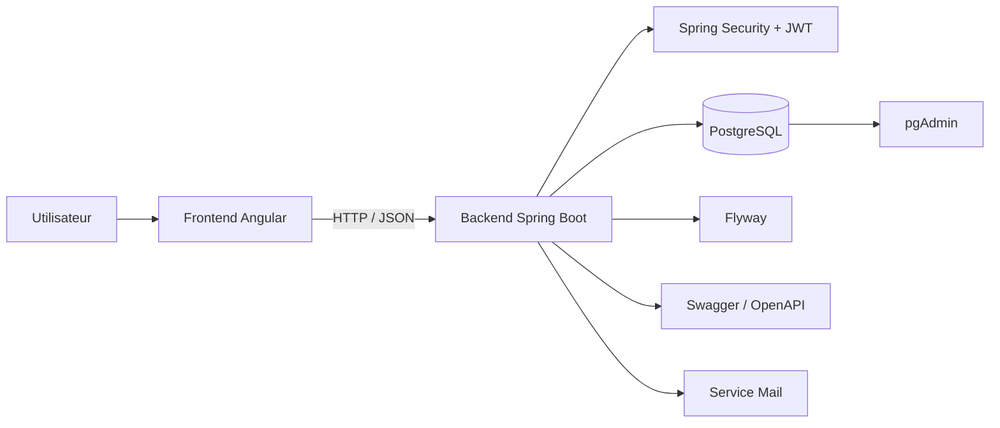

# Diagramme 01 - Architecture globale

```mermaid
flowchart LR
    U[Utilisateur] --> F[Frontend Angular]
    F -->|HTTP / JSON| B[Backend Spring Boot]
    B --> S[Spring Security + JWT]
    B --> DB[(PostgreSQL)]
    B --> FW[Flyway]
    B --> SW[Swagger / OpenAPI]
    B --> M[Service Mail]
    DB --> PG[pgAdmin]
```
