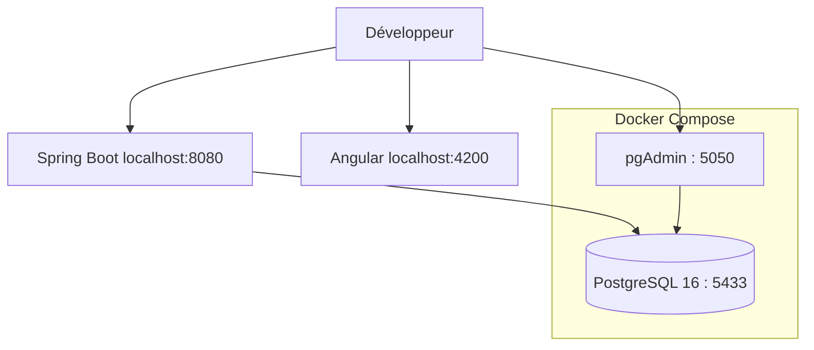

# Diagramme 02 - Déploiement local Docker

```mermaid
flowchart TB
    DEV[Développeur]
    DEV --> ANG[Angular localhost:4200]
    DEV --> SPR[Spring Boot localhost:8080]

    subgraph Docker Compose
        DB[(PostgreSQL 16 : 5433)]
        PGA[pgAdmin : 5050]
    end

    SPR --> DB
    DEV --> PGA
    PGA --> DB
```
