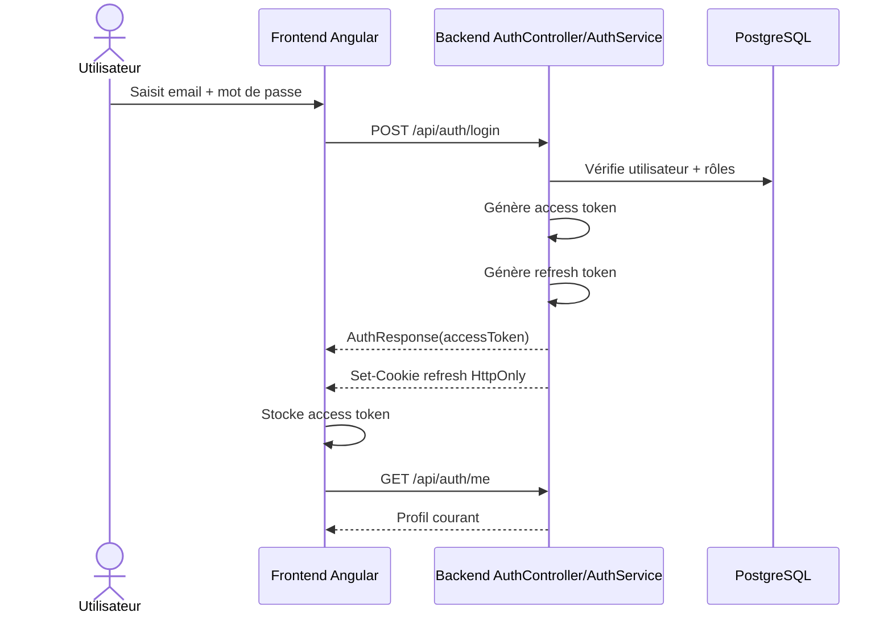

# Diagramme 03 - Séquence Login

```mermaid
sequenceDiagram
    actor U as Utilisateur
    participant F as Frontend Angular
    participant B as Backend AuthController/AuthService
    participant DB as PostgreSQL

    U->>F: Saisit email + mot de passe
    F->>B: POST /api/auth/login
    B->>DB: Vérifie utilisateur + rôles
    B->>B: Génère access token
    B->>B: Génère refresh token
    B-->>F: AuthResponse(accessToken)
    B-->>F: Set-Cookie refresh HttpOnly
    F->>F: Stocke access token
    F->>B: GET /api/auth/me
    B-->>F: Profil courant
```
