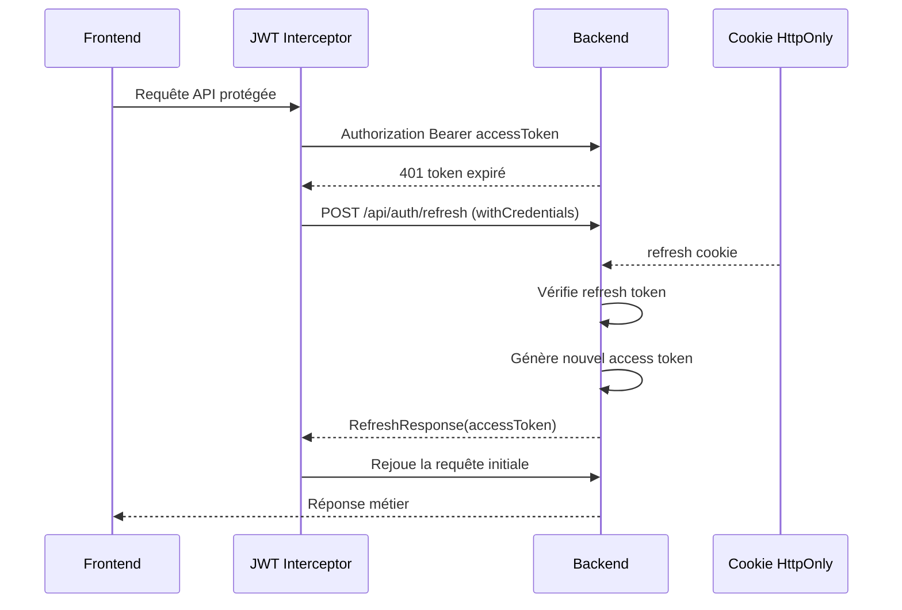

# Diagramme 04 - Séquence Refresh token

```mermaid
sequenceDiagram
    participant F as Frontend
    participant I as JWT Interceptor
    participant B as Backend
    participant C as Cookie HttpOnly

    F->>I: Requête API protégée
    I->>B: Authorization Bearer accessToken
    B-->>I: 401 token expiré
    I->>B: POST /api/auth/refresh (withCredentials)
    C-->>B: refresh cookie
    B->>B: Vérifie refresh token
    B->>B: Génère nouvel access token
    B-->>I: RefreshResponse(accessToken)
    I->>B: Rejoue la requête initiale
    B-->>F: Réponse métier
```
