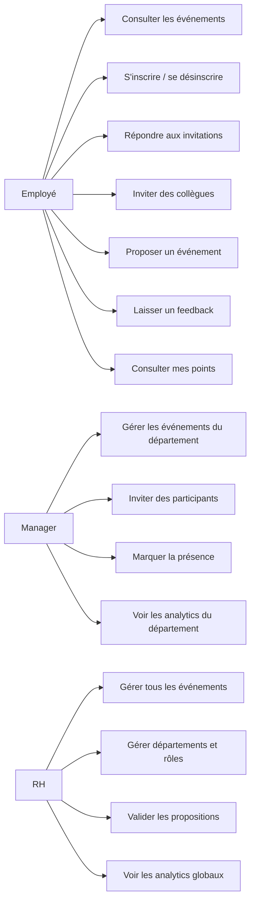

# Diagramme 05 — Use case global

```mermaid
flowchart LR
    EMP[Employé]
    MAN[Manager]
    HR[RH]

    EMP --> UC1[Consulter les événements]
    EMP --> UC2[S'inscrire / se désinscrire]
    EMP --> UC3[Répondre aux invitations]
    EMP --> UC4[Inviter des collègues]
    EMP --> UC5[Proposer un événement]
    EMP --> UC6[Laisser un feedback]
    EMP --> UC7[Consulter mes points]

    MAN --> UC8[Gérer les événements du département]
    MAN --> UC9[Inviter des participants]
    MAN --> UC10[Marquer la présence]
    MAN --> UC11[Voir les analytics du département]

    HR --> UC12[Gérer tous les événements]
    HR --> UC13[Gérer départements et rôles]
    HR --> UC14[Valider les propositions]
    HR --> UC15[Voir les analytics globaux]
```
