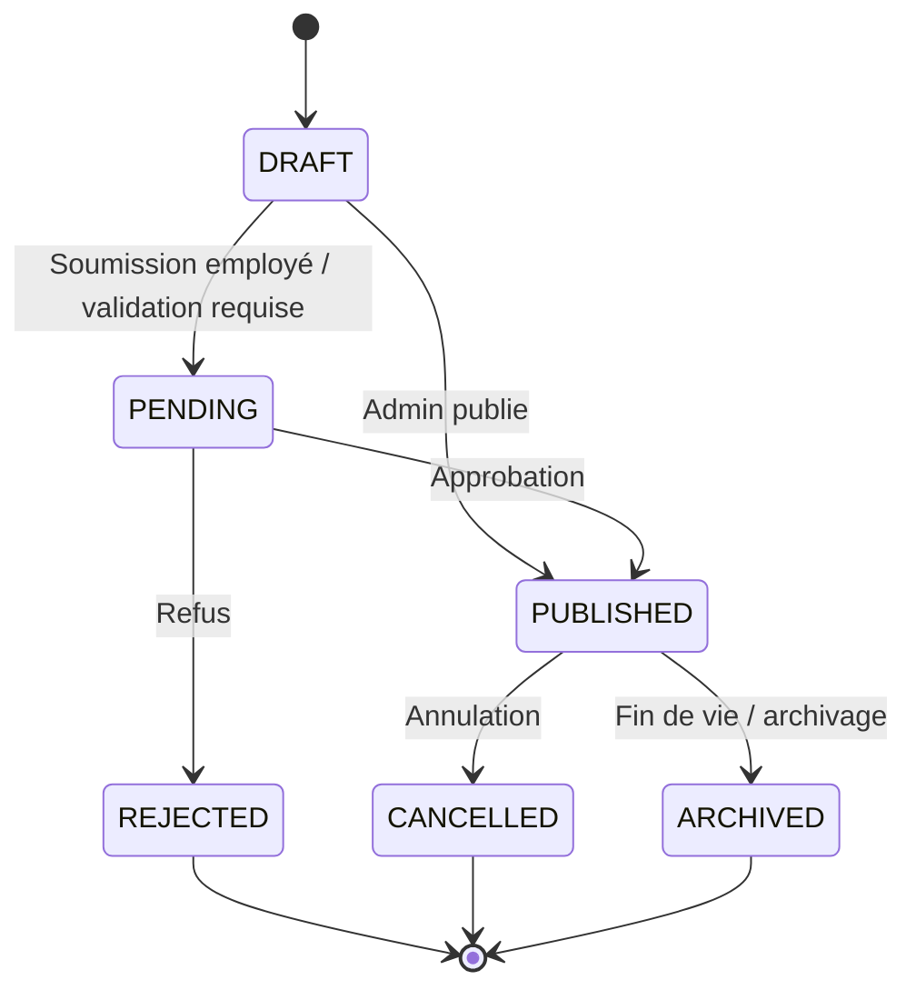

# Diagramme 06 — Cycle de vie d'un événement

```mermaid
stateDiagram-v2
    [*] --> DRAFT
    DRAFT --> PENDING : Soumission employé / validation requise
    DRAFT --> PUBLISHED : Admin publie
    PENDING --> PUBLISHED : Approbation
    PENDING --> REJECTED : Refus
    PUBLISHED --> CANCELLED : Annulation
    PUBLISHED --> ARCHIVED : Fin de vie / archivage
    REJECTED --> [*]
    CANCELLED --> [*]
    ARCHIVED --> [*]
```
