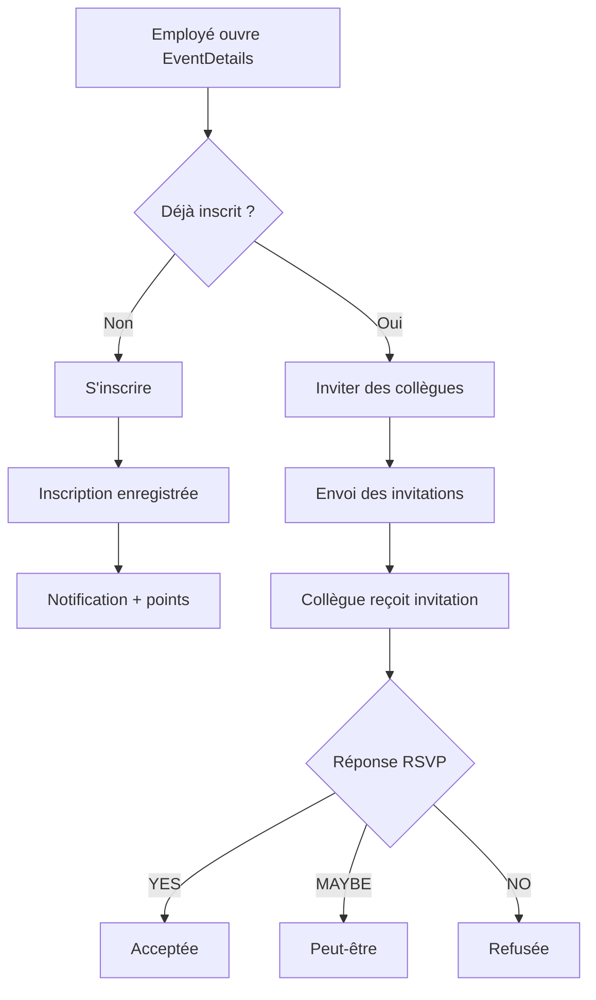

# Diagramme 07 — Inscription + invitation + RSVP

```mermaid
flowchart TD
    A[Employé ouvre EventDetails] --> B{Déjà inscrit ?}
    B -- Non --> C[S'inscrire]
    C --> D[Inscription enregistrée]
    D --> E[Notification + points]

    B -- Oui --> F[Inviter des collègues]
    F --> G[Envoi des invitations]
    G --> H[Collègue reçoit invitation]
    H --> I{Réponse RSVP}
    I -- YES --> J[Acceptée]
    I -- MAYBE --> K[Peut-être]
    I -- NO --> L[Refusée]
```
