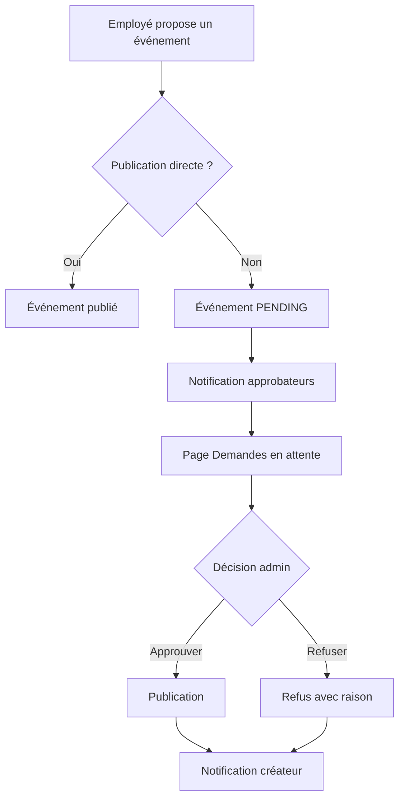

# Diagramme 08 — Proposition d'événement et validation

```mermaid
flowchart TD
    A[Employé propose un événement] --> B{Publication directe ?}
    B -- Oui --> C[Événement publié]
    B -- Non --> D[Événement PENDING]
    D --> E[Notification approbateurs]
    E --> F[Page Demandes en attente]
    F --> G{Décision admin}
    G -- Approuver --> H[Publication]
    G -- Refuser --> I[Refus avec raison]
    H --> J[Notification créateur]
    I --> J
```
