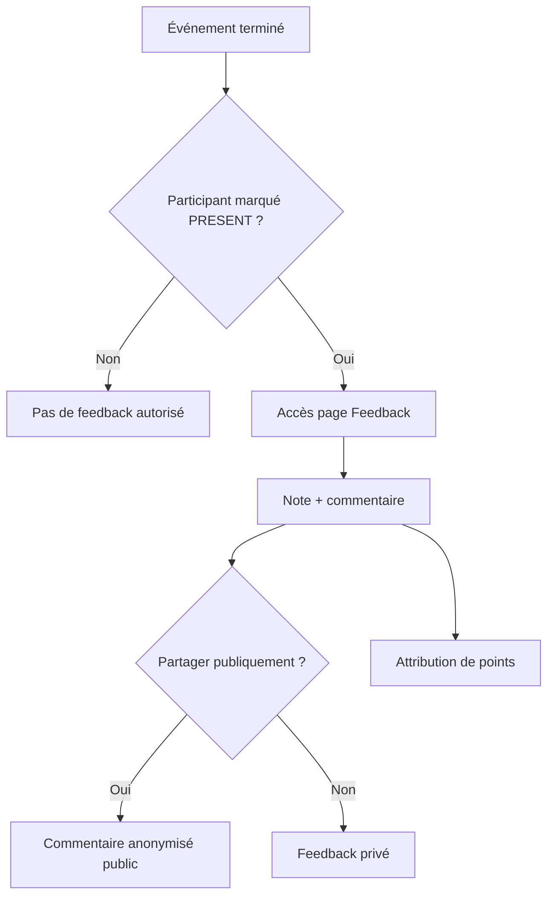

# Diagramme 09 - Feedback et points

```mermaid
flowchart TD
    A[Événement terminé] --> B{Participant marqué PRESENT ?}
    B -- Non --> X[Pas de feedback autorisé]
    B -- Oui --> C[Accès page Feedback]
    C --> D[Note + commentaire]
    D --> E{Partager publiquement ?}
    E -- Oui --> F[Commentaire anonymisé public]
    E -- Non --> G[Feedback privé]
    D --> H[Attribution de points]
```
