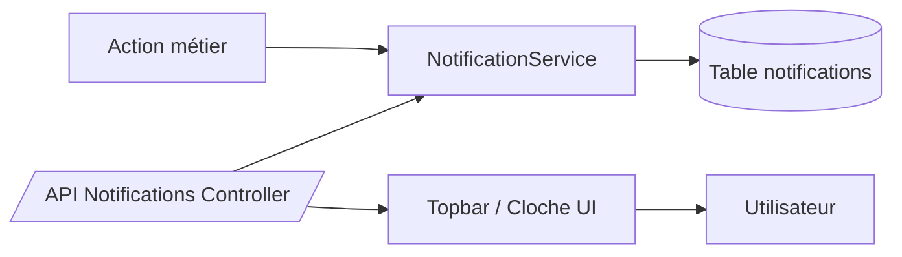

# Diagramme 10 - Notifications

```mermaid
flowchart LR
    ACT[Action métier] --> N[NotificationService]
    N --> DB[(Table notifications)]
    API[/API Notifications Controller/] --> N
    API --> TOP[Topbar / Cloche UI]
    TOP --> USER[Utilisateur]
```
