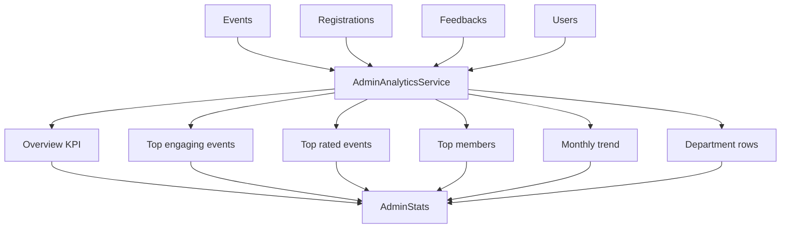

# Diagramme 11 — Pipeline analytics

```mermaid
flowchart TD
    E[Events] --> A[AdminAnalyticsService]
    R[Registrations] --> A
    F[Feedbacks] --> A
    U[Users] --> A

    A --> O1[Overview KPI]
    A --> O2[Top engaging events]
    A --> O3[Top rated events]
    A --> O4[Top members]
    A --> O5[Monthly trend]
    A --> O6[Department rows]

    O1 --> UI[AdminStats]
    O2 --> UI
    O3 --> UI
    O4 --> UI
    O5 --> UI
    O6 --> UI
```
