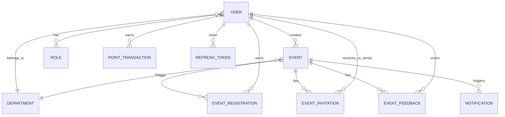

# Diagramme 12 - ERD simplifié

```mermaid
erDiagram
    USER ||--o{ EVENT : creates
    USER }o--o{ ROLE : has
    USER }o--|| DEPARTMENT : belongs_to

    EVENT }o--|| DEPARTMENT : targets
    EVENT ||--o{ EVENT_REGISTRATION : has
    EVENT ||--o{ EVENT_INVITATION : has
    EVENT ||--o{ EVENT_FEEDBACK : has
    EVENT ||--o{ NOTIFICATION : triggers

    USER ||--o{ EVENT_REGISTRATION : owns
    USER ||--o{ EVENT_INVITATION : receives_or_sends
    USER ||--o{ EVENT_FEEDBACK : writes
    USER ||--o{ POINT_TRANSACTION : earns
    USER ||--o{ REFRESH_TOKEN : owns
```
