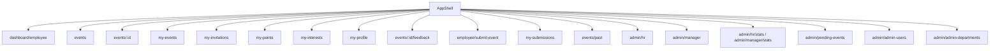

# Diagramme 13 — Carte des routes frontend

```mermaid
flowchart TD
    APP[AppShell] --> DASH_EMP[dashboard/employee]
    APP --> EVENTS[events]
    APP --> EVENT_DETAILS[events/:id]
    APP --> MY_EVENTS[my-events]
    APP --> MY_INV[my-invitations]
    APP --> MY_POINTS[my-points]
    APP --> MY_INTERESTS[my-interests]
    APP --> MY_PROFILE[my-profile]
    APP --> FEEDBACK[events/:id/feedback]
    APP --> SUBMIT[employee/submit-event]
    APP --> SUBMISSIONS[my-submissions]
    APP --> PAST[events/past]
    APP --> ADMIN_HR[admin/hr]
    APP --> ADMIN_MANAGER[admin/manager]
    APP --> ADMIN_STATS[admin/hr/stats / admin/manager/stats]
    APP --> PENDING[admin/pending-events]
    APP --> USERS[admin/admin-users]
    APP --> DEPTS[admin/admin-departments]
```
