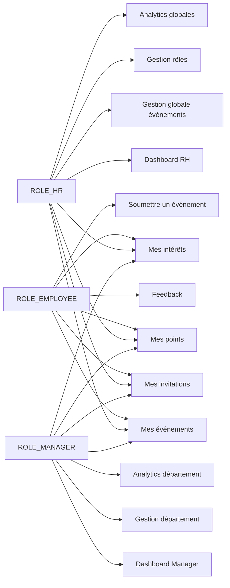

# Diagramme 14 — Carte d'accès par rôles

```mermaid
flowchart LR
    RH[ROLE_HR] --> A1[Dashboard RH]
    RH --> A2[Gestion globale événements]
    RH --> A3[Gestion rôles]
    RH --> A4[Analytics globales]

    MAN[ROLE_MANAGER] --> B1[Dashboard Manager]
    MAN --> B2[Gestion département]
    MAN --> B3[Analytics département]

    EMP[ROLE_EMPLOYEE] --> C1[Mes événements]
    EMP --> C2[Mes invitations]
    EMP --> C3[Mes points]
    EMP --> C4[Mes intérêts]
    EMP --> C5[Feedback]
    EMP --> C6[Soumettre un événement]

    RH --> C1
    RH --> C2
    RH --> C3
    RH --> C4
    MAN --> C1
    MAN --> C2
    MAN --> C3
    MAN --> C4
```
